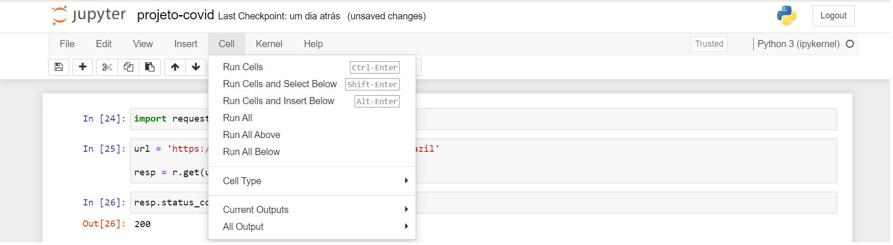

# Olááá!!!
Este repositório foi criado para mostrar o projeto que foi desenvolvido durante a segunda etapa do processo seletivo do 'Beca Santander - Analista de dados'.

# Tecnologias
* Python 3
* Jupyter Notebook
* Api Covid
* Quick Chart

# Como usar?
Para executar o projeto clonar o repositório e executar todas as células do Jupyter Notebook. 

ATENÇÃO: Verifique se alguma das APIs utilizadas necessitam de autenticação.

